# DEPLOYMENT OF A MICROSERVICE APPLICATION ON KUBERNETES USING TERRAFORM AS IaaC
---

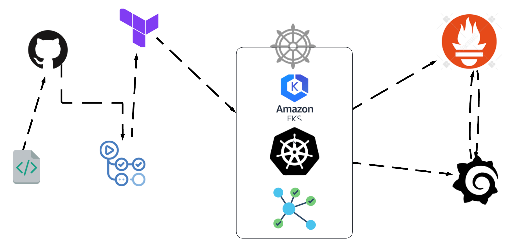

---

## Project Overview: 

**Objective:** 
We aim to deploy a microservices-based application, specifically the Socks Shop, using a modern approach that emphasizes automation and efficiency. The goal is to use Infrastructure as Code (IaaC) for rapid and reliable deployment on Kubernetes.

Link to application repo on github:
[socks shop microservice application](https://github.com/microservices-demo/microservices-demo.github.io)


**Aim:** 
The aim of this project is to set up the Socks Shop application, a demonstration of a microservices architecture, available on GitHub. We'll be using tools and technologies that automate the setup process, ensuring that the application can be deployed quickly and consistently.

## PROJECT DELIVERABLES
- All deliverables need to be deployed using an Infrastructure as Code approach.
- Readability and maintainability (make yor application deployment clear)
- A clear way to recreate the setup and will evaluate the project decisions based on:
    ```
    Deploy pipeline
    Metrics (Alertmanager)
    Monitoring (Grafana)
    Logging (Prometheus)
    ```
- The application should use Prometheus as a monitoring tool
-  The application should use Ansible or Terraform as the configuration management tool
-  The application should use anY IaaS provider
-  The application should run on Kubernetes

## PROJECT REQUIREMENTS
- AWS Account
- IAM User Credentials
- Terraform
- Kubernetes
- Kubectl
- Prometheus
- Helm
- CICD (Github Actions)
- Prompt Engineering


# Step 1:

### The first step is to download all and configure all the tools required to implement this project. Tools like AWS CLI, Terraform, kubectl

- AWS CLI
    Create an AWS Account [HERE](https://aws.amazon.com/free/?gclid=Cj0KCQjwzby1BhCQARIsAJ_0t5PloPO6_AZmfWRFblBUfZ3wER05XP0LzfwiDr4-u4scemxMVSRQiXcaAmjVEALw_wcB&trk=99f831a2-d162-429a-9a77-a89f6b3bd6cd&sc_channel=ps&ef_id=Cj0KCQjwzby1BhCQARIsAJ_0t5PloPO6_AZmfWRFblBUfZ3wER05XP0LzfwiDr4-u4scemxMVSRQiXcaAmjVEALw_wcB:G:s&s_kwcid=AL!4422!3!645125273279!e!!g!!aws%20sign%20up!19574556890!145779847592)

    Download AWS CLI [HERE](https://aws.amazon.com/cli/)

    Configure the AWS CLI with your IAM User credentials
    ```
    aws config

    $ AWS Access Key ID [None]: <YOUR_AWS_ACCESS_KEY_ID>

    $ AWS Secret Access Key [None]: <YOUR_AWS_SECRET_ACCESS_KEY>

    $ Default region name [None]: <YOUR_AWS_REGION>
    
    ```

- Terraform
    
    Download Terraform [HERE](https://developer.hashicorp.com/terraform/install)

- kubectl
    D
    ownload kubectl [HERE](https://kubernetes.io/docs/tasks/tools/)


# Step 2:

 ### After having installed the necessary tools, the next step now is to provision our cluster. We will be using EKS cluster for this project.

 In order to do this, we would be utilizing the learn EKS documentation by Hashicorp.

 - Create a project folder

 - Clone this repo 
    ```
    git clone https://github.com/YekAz/Microservice-Application--Deployment.git
    ```
 - cd into the terraform directory in the project folders and initialize terraform
    ```
    cd Terraform
    terraform init
    ```
 - Check for the infra that would be provisioned using:
    ```
    terraform plan
    ```
 - Create the kubernetes cluster with:
    ```
    terraform apply --auto-approve
    ```
 - Here is a screenshot of my kubernetes cluster (EKS):
    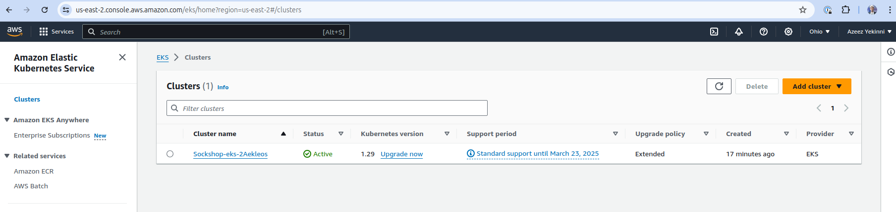


# Step 3:

### Next step is to connect our kubectl to our cluster so we can have access to it on Kubernetes and also create the helm application for the deployment of the microservices and ingress on the cluster

- Run the following command to retrieve the access credentials for your cluster and configure kubectl.
    
    ```
    aws eks --region $(terraform output -raw region) update-kubeconfig \
    --name $(terraform output -raw cluster_name)
    ```

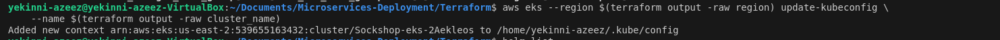

- Run the command below to create the helm application:

    ```
    helm create app
    ```
- Then move the deployment file and ingress files into the `template` folder

- Then deploy the microservices with the command:

    ```
    helm install sockshop-app ./app
    ```

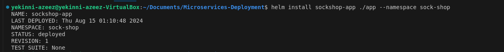

Ingress is also deployed.

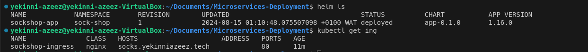

Pods and Services
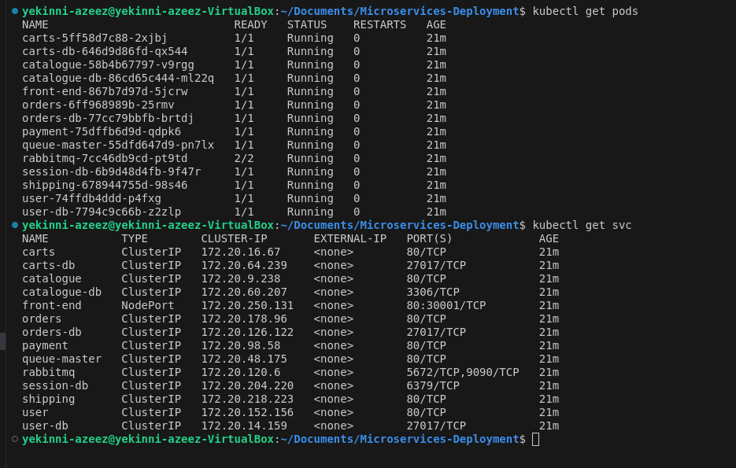

# Step 4:
### Serving of front-end service.

Since we used a host based ingress, we would be able to access our front-end service through the host name defined in our ingress file: `sock.yekinniazeez.tech`

- Firstly, we would download the Nginx-Ingress-Controller repo using Helm and then install it.

Run the command to download the ingress controller repo:

    helm repo add ingress-nginx https://kubernetes.github.io/ingress-nginx
    helm repo update

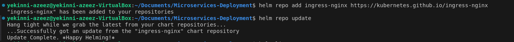
     
Run the command to install Nginx-Ingress-Controller:

    helm install ingress ingress-nginx/ingress-nginx

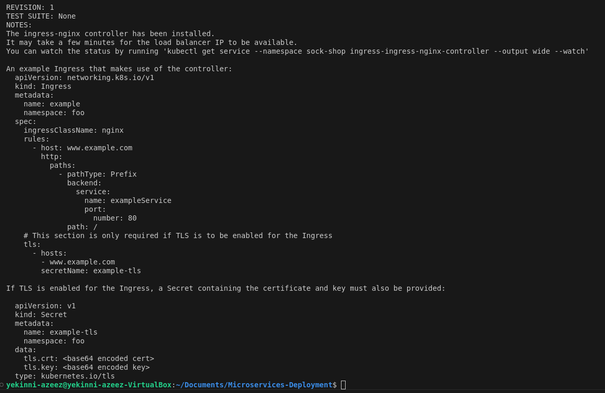

Load Balancer created by the Nginx-Ingress-Controller

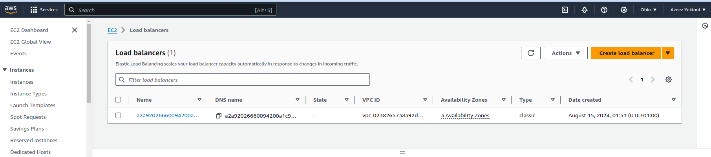

- Then, we will create an A - record for our host name on AWS Route-53 that will point to the load balancer that would be created by the ingress controller.

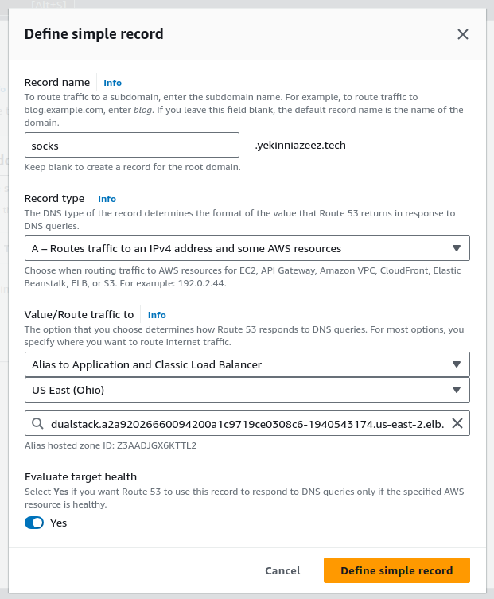

- I can now access the front-end service through the host-name: `socks.yekinniazeez.tech`

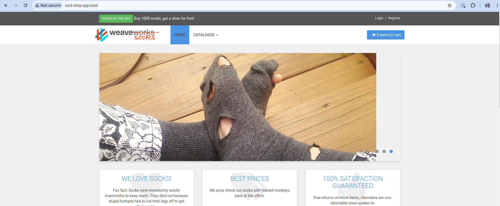

# Step 5:
### Configure Prometheus and Grafana

We will be installing prometheus and grafana through one helm chart that works for both then we configure them and access the grafana dashboard.

- Download prometheus repo with the following command:

    ```
    helm repo add prometheus-community https://prometheus-community.github.io/helm-charts
    helm repo update
    ```

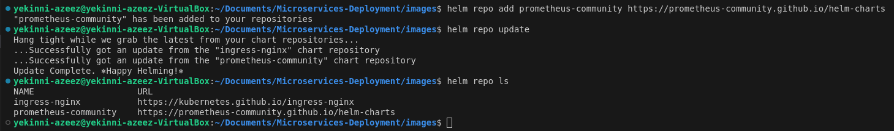

- Install Prometheus from the repo

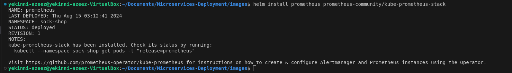

- Update `Ingress file` to include prometheus and grafana hosts and then create A - records for the host name so we can access both

- Prometheus Interface

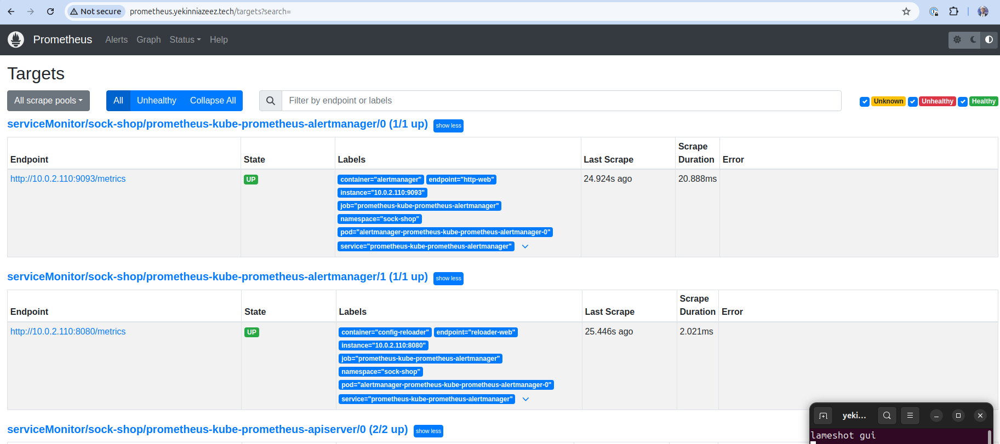

- grafana Dashboard

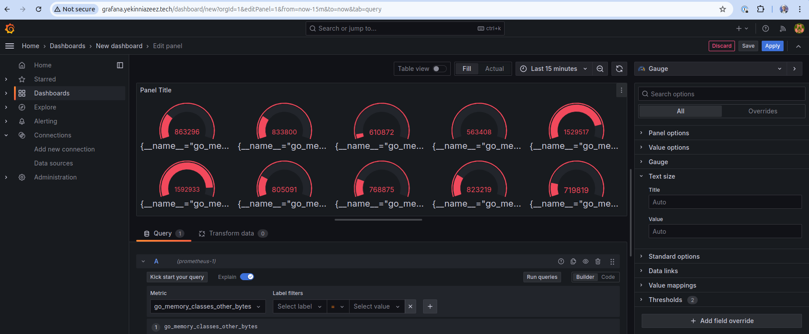
---

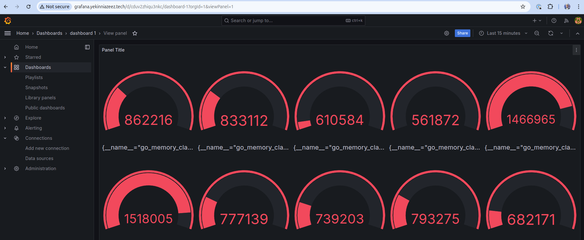

# Step 6:
### Encryption

- Add the Helm Jetstack repo for Cert Manager
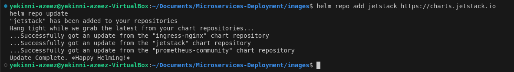

- Install the Cert Manager
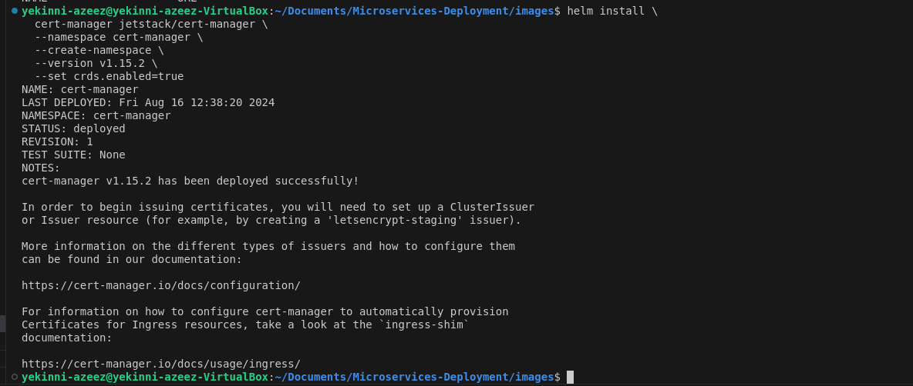

- Create a `cluster-issuer.yml` file

    apiVersion: cert-manager.io/v1
        kind: ClusterIssuer
        metadata:
    name: letsencrypt-prod
        spec:
        acme:
            # The ACME server URL for Let's Encrypt production
            server: https://acme-v02.api.letsencrypt.org/directory
            # Email address for notifications about certificate expiry, etc.
            email: yekinniazeez.cloud@gmail.com
            # Secret to store the ACME account private key
            privateKeySecretRef:
            name: letsencrypt-prod
            # Use the HTTP-01 challenge mechanism
            solvers:
            - http01:
                ingress:
                class: nginx

- Apply the `cluster-issuer.yml` file:

    kubectl apply -f cluster-issuer.yml

- Update ingress file to enable TLS encryption using Cert-Manager

- Apply the update ingress file

- Verify Certificate issuance:

Verify Certificate for the front-end service `(socks.yekinniazeez.tech)`:

    kubectl describe certificate socks-tls -n sock-shop

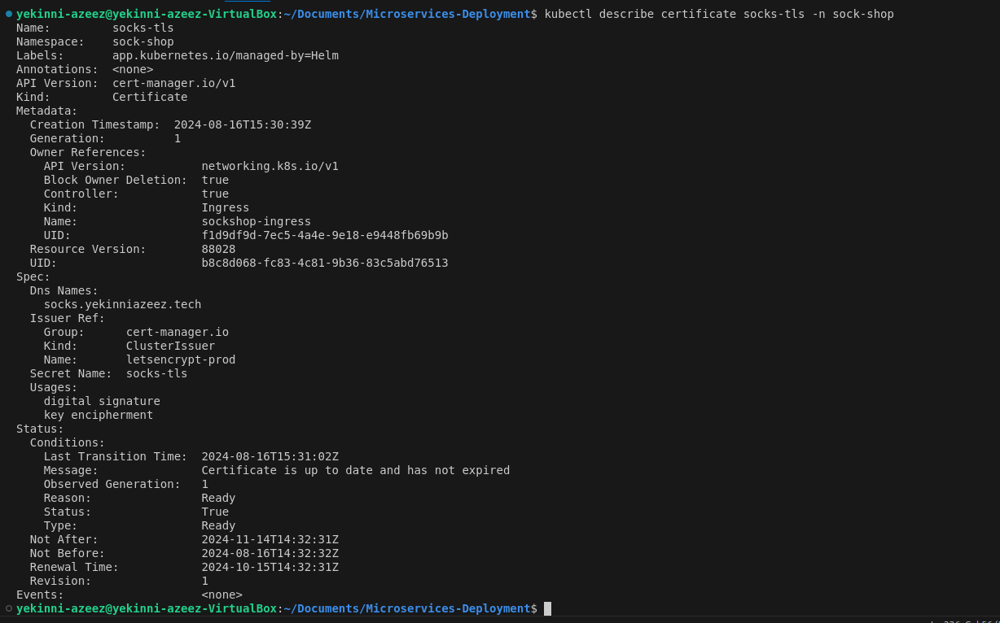

Verify Certificate for the prometheus service `(prometheus.yekinniazeez.tech)`:

    kubectl describe certificate prometheus-tls -n sock-shop

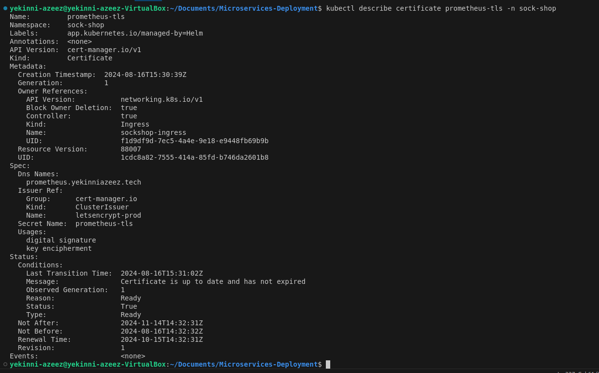

Verify Certificate for the grafana service `(grafan.yekinniazeez.tech)`:

    kubectl describe certificate grafana-tls -n sock-shop


#### Services are noe encrypted and can be accessd with:

- https://socks.yekinniazeez.tech

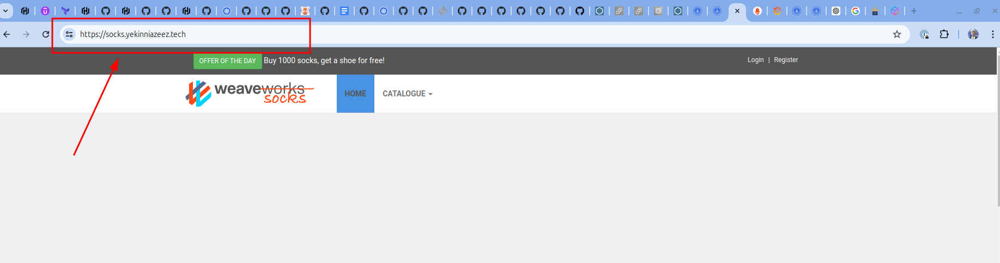
---

- https://prometheus.yekinniazeez.tech

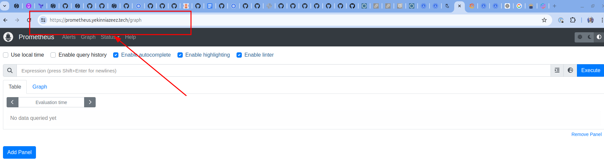
---

- https://grafana.yekinniazeez.tech

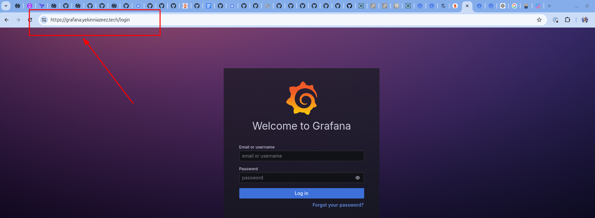